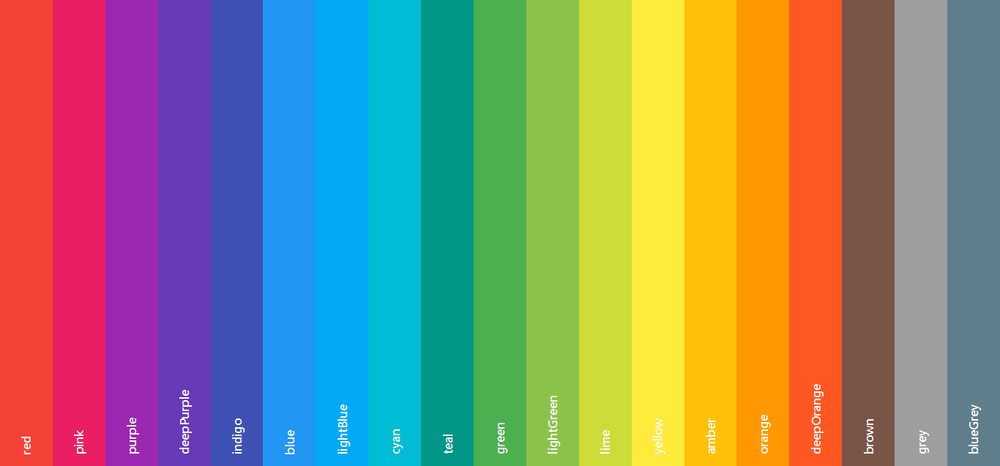

# index

index 是一款在线书签应用.

它是无用户的, 从浏览器缓存为你提供便捷的, 个性化的书签服务.

## 简单使用

它的默认页面尽可能保持干净整洁, 就像: 

现在, 让我们添加第一个书签! 来到右上角的菜单栏, 点击添加书签, 进入以下页面:

一个最简单的书签, 由 `书签标题` 和 `书签链接` 构成, 我可以填入这样的值:

- 书签标题: 配色助手
- 书签链接: https://cyanglory.github.io/mui-colors/

现在, 我们点击完成按钮, 你会看到 `Main` 这个组多出了一个小标签:

当你点击这个新添加的 `书签`, 你将会打开链接所指向的 网页地址, 嗨, 看看我们到哪儿了!

一个色彩斑斓的地方, 稍后我们或许会使用到它.

现在, 你已经完成了你的第一个书签.

## 为何使用 index

index 是我为自己开发的书签应用, 作为一个 `程序员`, 我非常需要能够快速到达那些我想去的地方, 而如果你也需要这一点, 刚好可以拿走.

它具有如下特性: 

- 无账户
- 自定义分组
- 书签个性化
- 关键词检索
- 数据可移植
- 静态服务
- 可配置的风格
- 多语言: 中文/English

但使用它也有一些要求, 
浏览器兼容性列表如下(来自UI控件的需要):

IE | Edge | Firefox | Chrome | Safari
---|---|---|---|---
11 | >= 14 | >= 45 | >= 49 | >= 10

数据存储在浏览器缓存(localStorage)中, 如果你需要清理缓存, 请在设置中使用导出, 备份数据.

当你需要从磁盘数据恢复的时候, 上传你所得到的备份文件即可, 名称通常为 `index.bac***.json`, 上传文件时, 会有一个前缀名和后缀名校验, 所以, 重命名后请不要因为无法导入感到惊讶.

### 在新分组中添加一个个性化的书签

默认: 我们会有两个分组, Main(主要的链接), Temp(临时的链接)

我们在右上角的 `菜单` > `分组管理`, 添加一个自定义的分组, 例如: `设计`.

然后, 在 `添加书签` 中, 选择 `书签类型` 设计, 输入我们的标题和链接:

- 标题: IconFont 图标库
- 链接: http://www.iconfont.cn/

选择图标类型为 `一个字符`, 图标值为: `I`, 颜色为: `#f44336`, 完成添加.

我们得到了一个非常简单鲜明的链接:

### 导入和导出

通常情况下, 你关闭浏览器, 重新打开 index, 数据和你离开时是一样的, 除了位于设置页面的时候, 部分数据是在返回主页时更新的.

在设置页面中, 导出数据将下载一个 json 文件, 而导入数据可以使用这个 json 文件还原你的浏览器缓存(index 所使用的一小部分),
`点击下载`  `选择上传`.

默认是不提供 书签编辑功能的, 新增一个书签是非常简单的, 而如果你是在需要 进行编辑, 也不是没有办法, 建议你下载一个简单的文本编辑器 notpad++, 是用它来编辑 json 文件, 然后上传, 通常情况下, 懂一点儿英语就可以按照字面量去修改了.

### 多语言支持

在应用内, 切换 中文/English 是非常容易的, 选择对应的语言即可, 其他语言暂不做支持, 另外, 文档目前仅提供中文版.

### 自定义风格

你可以改变首页所显示的文字和主题色, 来让它更符合你的 feel, 19种 素材风格的主题供你选择.

对话框的颜色会采用当前 `主题色` 的前一个颜色, 来达到一个简单的配色效果.

### 可检索

在搜索栏输入你想要检索的 `标题`, 如果一个链接包含此输入, 则会显示, 每次键入都会触发检索, 搜索按钮属于语义提示, 点击无效.

### 数据移植

如果你希望从设备 a, 将数据转移到设备 b, 聪明的你一定知道 从 `a` 下载 json 文件, 在 `b` 上传就可以了.

### 无账户

为什么设计成无账户的呢? 

有几十个各种账号的表示很头疼. 

另外, 一个人维护一个 `账户管理系统`, 我可能无法保障你的数据安全, 对于这方面, 我考虑了很多, 最终放弃了根据账号 同步数据的便利服务.

### 退出对话框

通过 `完成` 和 `取消` 退出对话框, 输入的内容被清空, 通过点击对话框外部退出, 内容则会被保留.

### 结束

它最终表现为一个开箱即用的静态书签站点. 希望它能在你的浏览器里, 成为一个合格的路标.

更多功能, 你可以自行探索...